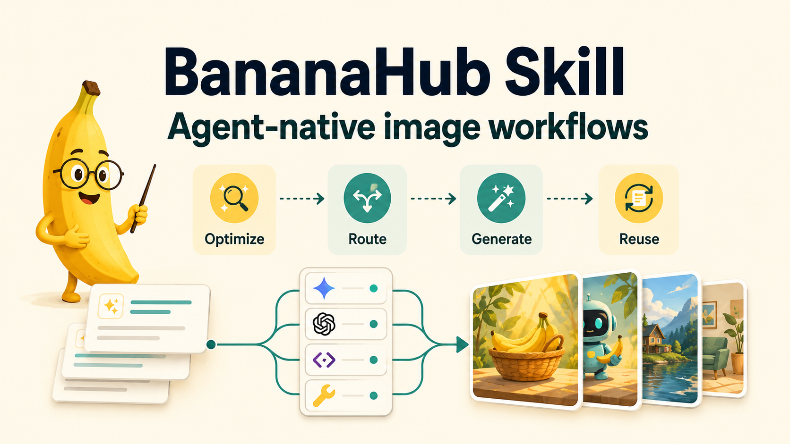
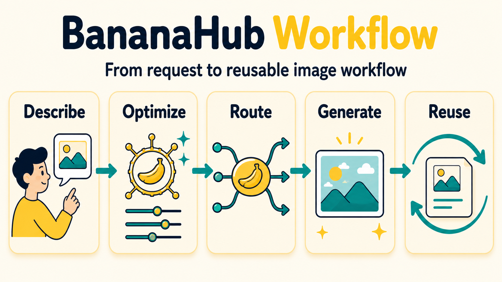
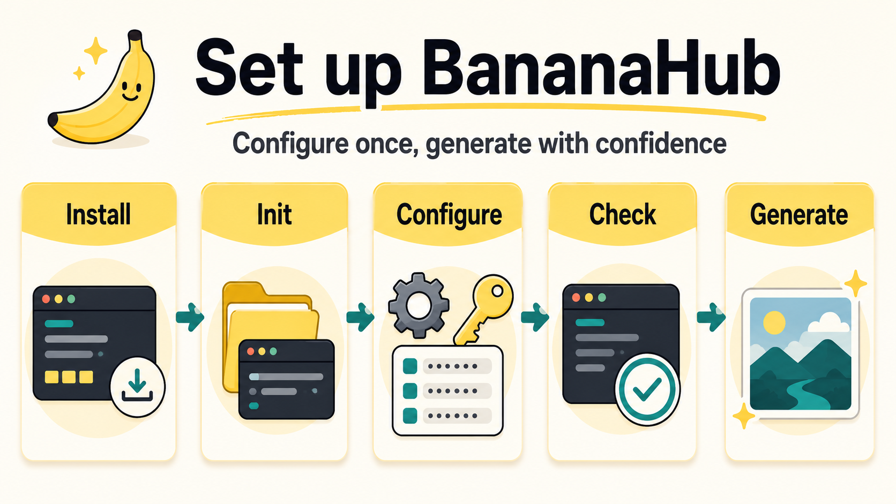
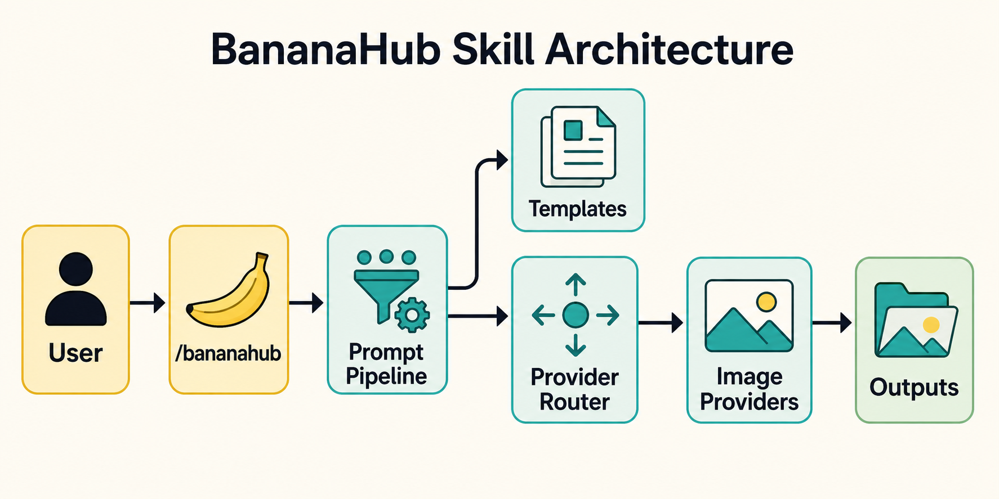

# BananaHub Skill 🍌

[简体中文说明](./README.zh-CN.md)



BananaHub is an agent-native image workflow skill. Describe what you want in Chinese, English, or mixed language; BananaHub cleans up the prompt, detects the available runtime, routes the task to the right image path, and keeps generation, editing, templates, and reusable prompts under one `/bananahub` command.

It is not just a prompt helper. BananaHub acts as a workflow layer between agents and image providers: GPT Image 2 by default, plus Gemini / Nano Banana, OpenAI official, compatible gateways, and host-native image tools when configured.

## Why BananaHub

- **Works in more environments**: direct provider calls when keys are configured, host-tool delegation when the client already has image generation, prompt-only output when no image runtime is available.
- **Less rework**: locks text, layout, preserved elements, and edit boundaries before generation.
- **Multi-model without guesswork**: prompt cleanup and archiving are cross-model; mask edits, native sizes, reference limits, quality presets, and output formats stay provider/model-scoped.
- **Reusable by default**: archive final prompts for handoff, QA, reruns, and template authoring.
- **Template-ready**: use built-ins, install more from BananaHub, or create repeatable prompt/workflow modules.

## Quick Start

```bash
# Open Agent Skills / skills.sh
npx skills add https://github.com/bananahub-ai/bananahub-skill --skill bananahub

# Or install directly in Claude Code
claude skill install https://github.com/bananahub-ai/bananahub-skill

/bananahub init
/bananahub 一只橘猫趴在键盘上打盹
```

`init` defaults to GPT Image 2 through an OpenAI-compatible image endpoint. If you choose or already configured another provider, BananaHub uses that provider as the default for future runs.

Check the current execution path:

```bash
python3 scripts/bananahub.py check-mode --pretty
```

## Workflow



The core loop is simple: describe the image, let BananaHub optimize and route the request, generate through the configured provider, then reuse the archived prompt or template.

## Runtime Modes

| Mode | When It Applies | What BananaHub Does |
|---|---|---|
| `provider-backed` | A supported provider and key are configured | Optimizes the prompt, calls the provider, and saves outputs |
| `host-native` | Local provider config is incomplete, but the host agent has an image tool | Optimizes/archives the prompt, then delegates image generation to the host |
| `prompt-only` | No provider and no host image tool are available | Returns a reusable prompt; never pretends an image was generated |

For CLI checks, use `BANANAHUB_HOST_IMAGEGEN=1` or `check-mode --host-imagegen` to mark host-native image generation as available.

## Setup Flow



Configuration is intentionally profile-based: initialize once, persist provider credentials locally, check the runtime path, and keep future runs predictable.

## Best Fit

- **Everyday visual work**: product clean shots, background replacement, article one-pagers, infographics, and repo explainers.
- **Knowledge visuals**: turn processes, long-form content, or codebase context into readable one-image summaries.
- **Provider-aware teams**: use the same template IDs across Gemini / Nano Banana and OpenAI GPT Image without hiding model-specific limits.
- **Reusable workflows**: archive prompts and install richer templates from BananaHub instead of bloating the skill package.

## Commands

| Command | Use |
|---|---|
| `/bananahub <description>` | Optimize the prompt and generate an image |
| `/bananahub edit <description> --input <image>` | Edit an existing image |
| `/bananahub optimize <description>` | Optimize only, no generation |
| `/bananahub generate <English prompt>` | Generate directly from an English prompt |
| `/bananahub models` | List available models |
| `/bananahub check-mode` | Inspect runtime mode and capability layers |
| `/bananahub templates` | List built-in and installed templates |
| `/bananahub use <template-id>` | Use a prompt template or start a workflow template |
| `/bananahub discover <need>` | Search BananaHub for matching templates |
| `/bananahub init` | Check and initialize the environment |

## Common Flags

| Flag | Meaning |
|---|---|
| `--direct` | Fewer confirmations; still conservative about creative additions |
| `--raw` | Translate/clean only, no extra enhancement |
| `--model <id>` | Select a model, e.g. `gemini-3-pro-image-preview`, `gpt-image-2` |
| `--provider <id>` | Override provider for one run, e.g. `openai`, `google-ai-studio` |
| `--aspect <ratio>` | Aspect ratio, e.g. `16:9`, `1:1`, `9:16` |
| `--image-size <preset>` | Gemini native size preset: `1K`, `2K`, `4K` |
| `--n <count>` | OpenAI Images API number of generated/edited outputs |
| `--openai-size <value>` | OpenAI Images API native size option |
| `--quality <value>` | Provider-native quality preset |
| `--background <value>` | Provider-native background option |
| `--output-format <value>` | Provider-native output format, e.g. `png`, `jpeg`, `webp` |
| `--output-compression <value>` | Provider-native output compression when supported |
| `--response-format <value>` | Optional legacy OpenAI Images response override: `url` or `b64_json` |
| `--timeout <seconds>` | OpenAI image request timeout override |
| `--resize <WxH>` | Resize after generation/editing |
| `--output <path>` | Image output path |
| `--save-prompt` | Archive the final prompt under `bananahub-prompts/` |
| `--prompt-output <path>` | Save the final prompt to a file or directory |
| `--input <path>` | Source image for edit commands |
| `--ref <path...>` | Reference images for edit commands |
| `--mask <path>` | OpenAI-native mask edit |

Set `BANANAHUB_SAVE_PROMPTS=1` to archive final prompts by default for generate/edit runs.
Set `BANANAHUB_IMAGE_TIMEOUT=<seconds>` to override the OpenAI image request timeout; the default is `900`. Use `--timeout <seconds>` for a single command.

## Prompt Archive

Prompt archive is useful for QA, handoff, reruns, provider switching, and template design.

```bash
python3 scripts/bananahub.py generate \
  "A clean product photo of a blue wireless earbud case" \
  --save-prompt

python3 scripts/bananahub.py generate \
  "A launch poster for BananaHub" \
  --prompt-output docs/prompts/launch-poster.md
```

The archive file stores command metadata, provider, model, timestamp, and the final prompt. It is written before the provider call, so a failed API request still leaves a reusable prompt behind.

## Provider Paths

BananaHub supports several provider routes. Advanced capabilities are not assumed globally; use `check-mode` and the capability registry to verify what is available.

| Provider | Best For | Generate | Edit | Mask | Notes |
|---|---|---:|---:|---:|---|
| `openai-compatible` | Recommended default for OpenAI-style image gateways | ✅ | ✅ | ✅ | GPT Image 2 path; standard Images API support depends on the gateway |
| `openai` | Official OpenAI GPT Image APIs | ✅ | ✅ | ✅ | GPT Image native route; supports multi-output and multi-image edits through Images API |
| `google-ai-studio` | Gemini / Nano Banana users | ✅ | ✅ | — | Gemini Developer API route |
| `gemini-compatible` | Gemini-style relays or proxies | ✅ | ✅ | — | Depends on the relay |
| `vertex-ai` | Enterprise GCP / Vertex AI | ✅ | ✅ | — | ADC or API key auth |
| `chatgpt-compatible` | Chat/completions endpoints that return images | ✅ | — | — | Best-effort URL/base64 extraction |

Setup examples:

```bash
# Agent/script-readable diagnosis before provider calls
python3 scripts/bananahub.py config doctor --json

# Recommended GPT Image gateway profile
python3 scripts/bananahub.py config quickset --provider openai-compatible --profile gpt --default-profile \
  --base-url https://your-openai-compatible-endpoint --api-key <your_key> --model gpt-image-2

# OpenAI official GPT Image profile
python3 scripts/bananahub.py config quickset --provider openai --profile gpt --default-profile \
  --api-key <your_openai_key> --model gpt-image-2

# Google AI Studio / Gemini Developer API profile
python3 scripts/bananahub.py config quickset --provider google-ai-studio --profile nano --default-profile \
  --api-key <your_api_key> --model gemini-3-pro-image-preview

# Gemini-compatible relay profile
python3 scripts/bananahub.py config quickset --provider gemini-compatible --profile nano --default-profile \
  --base-url https://your-gemini-endpoint --api-key <your_key> --model gemini-3-pro-image-preview

# Chat/completions-compatible image endpoint
python3 scripts/bananahub.py config quickset --provider chatgpt-compatible --profile chat --default-profile \
  --base-url https://your-chat-endpoint --api-key <your_key> --model gpt-5.4

# Vertex AI ADC profile
python3 scripts/bananahub.py config quickset --provider vertex-ai --profile vertex --default-profile \
  --auth-mode adc --project <gcp-project> --location global

# Human-terminal fallback when you want guided prompts
python3 scripts/bananahub.py init --wizard
```

Agents should use `config doctor --json`, collect only missing provider fields, and persist them with `config quickset`. Direct API-key entry is supported when the user chooses it; otherwise provide a quickset command with placeholders for the user's local terminal.
When an agent receives the key directly, prefer `--api-key-stdin` over `--api-key` so the secret is not placed in command arguments.

Manual validation for an OpenAI-compatible `gpt-image-2` gateway:

```bash
BANANAHUB_PROFILE=gpt python3 scripts/bananahub.py generate \
  "Create a cute sticker of a tiny cheerful robot holding a banana, rounded kawaii vector style, thick clean outlines, soft pastel colors, plain white background, no text." \
  --model gpt-image-2 \
  --aspect 1:1 \
  --no-fallback \
  --output /tmp/bananahub-gpt-image-2-retry-test.png
```

The command should return `status: "ok"` with `actual_model: "gpt-image-2"`; telemetry `HTTP 403` warnings do not indicate generation failure.

Config priority: `--config <file>` → selected profile in `~/.config/bananahub/config.json` → environment variables fill missing fields.

Use `BANANAHUB_PROFILE=<name>` to pick another persisted profile. Set `BANANAHUB_ENV_OVERRIDE=1` only when environment variables should temporarily override profile fields.

Agent-facing diagnostics are provider-scoped: `resolved_from` only points to active values, `ignored_config_sources` lists values inactive for the selected provider, and `env_shadowed_config_sources` lists environment values ignored because the selected profile already defines that field.

## How Prompt Optimization Works

```text
User input
  │
  ├─ Extract constraints: exact text / keep / avoid / platform / edit invariants
  ├─ Clean up: keyword dumps, SD/MJ syntax, negative phrasing, buried subjects
  ├─ Translate smartly: descriptive content → English; in-image text and proper names stay locked
  ├─ Detect intent: photo / product / diagram / sticker / text-heavy / 3d / concept-art ...
  └─ Enhance conservatively: add only useful detail; confirm high-impact creative choices
```

This layer is cross-model. Provider-dependent features such as mask edit, exact size, transparent background, quality presets, and reference-image limits are routed through provider/model metadata.

## Templates

Templates come in two shapes:



- **Prompt templates** assemble one reusable prompt for stable jobs such as product clean shots, infographic cards, or background replacement edits.
- **Workflow templates** guide multi-step jobs such as article one-page summaries or repository explainer diagrams.

```bash
/bananahub templates
/bananahub templates article-one-page-summary
/bananahub use info-diagram "PR review flow: Change, Review, Test, Fix, Merge"
/bananahub use background-replace-edit --input product.png
/bananahub discover logo system
/bananahub create-template
```

Built-ins are a lean starter pack: `product-white-bg`, `info-diagram`, `article-one-page-summary`, `repo-explainer-diagram`, and `background-replace-edit`. They are practical, low-maintenance, sample-free, and support both Gemini/Nano Banana and OpenAI GPT Image through provider-specific prompt variants.

Install richer official templates from `bananahub-ai/templates` through BananaHub discovery when you need style packs, logo systems, character workflows, campaign visuals, or heavier sample galleries. Community templates remain available through the broader catalog. User-installed templates live in `~/.config/bananahub/templates/` and take precedence over built-ins with the same ID.

## References

- Prompt rules: `references/prompt-guide.md`
- Capability layers: `references/capability-registry.md`
- Model registry: `references/model-registry.json`
- Template spec: `references/template-format-spec.md`
- Official sources: `references/official-sources.md`

## Requirements

- Claude Code / Open Agent Skills runtime with skill support
- Python 3.8+
- Optional: `google-genai`, `pillow`
- Optional: Gemini, OpenAI, or compatible gateway API key

## Contributing

Code and docs contributions are accepted under MIT. Built-in starter templates under `references/templates/` should stay lightweight and explicitly licensed; heavier sample galleries belong in official or community template repositories.

## License

- Code, scripts, and general repo docs: MIT
- Built-in starter templates under `references/templates/`: CC BY 4.0 unless a template directory states otherwise
